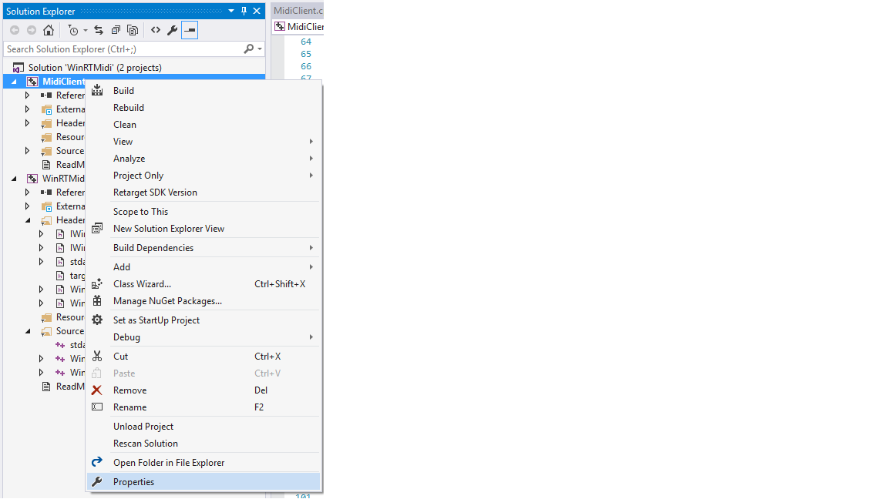
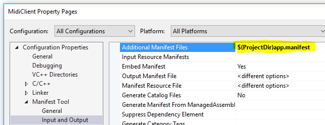

# WinRTMidi DLL #

This GitHub WinRTMidi project wraps the Windows Runtime [Windows::Devices::Midi](https://msdn.microsoft.com/library/windows/apps/windows.devices.midi.aspx) API 
in a Win32 DLL that can be dynamically loaded by a standard Win32 application. If the application is running on a device with Windows 10, the DLL will 
load and you will be able to use the Windows::Devices::Midi API via a C interface exported by the DLL.
If your application is running on devices with Windows 7 or Windows 8/8.1, the WinRTMidi DLL will not load. Your application will need to test if it is running on Windows 10 before
attempting to load the DLL (See [Testing for Windows 10](#testing-for-windows-10) below).  The Windows::Devices::Midi API is ony available on devices running Windows 10.

This DLL is useful for the scenario where you have an existing Win32 MIDI application and want to use the new Windows::Devices::Midi API. If you are not able to update your application to a 
Windows 10 UWP app, you can use the WinRTMidi DLL to access the Windows::Devices::Midi API when your application  is running on a device with Windows 10. You can use the WinRTMidi DLL with
applications built with Visual Studio 2010-2015. There is no need to rebuild your application with Visual Studio 2015 to access the Windows::Devices::Midi API using the WinRTMidi DLL.

The recommended steps to use this DLL are as follows:

1. Ship the WinRTMidi DLL with your Win32 application but do not link to the DLL.
1. When your Win32 application runs, check if your application is running on Windows 10 (See [Testing for Windows 10](#testing-for-windows-10) below).
1. If your application is running on Windows 10, dynamically load the WinRTMidi DLL using **LoadLibrary()**.
	* If your application is not running on Windows 10, continue to use the WinMM MIDI API.
1. Get pointers to the various WinRTMIDI functions using **GetProcAddress()**.
1. Initialize the WinRTMIDI API using the **winrt_initialize_midi()** function.
1. Obtain a MIDI port using **winrt_open_midi_in_port()** or **winrt_open_midi_out_port()** functions.
1. For more information see example code below.


The WinRTMid DLL enables the following MIDI functionality from the Windows::Devices::Midi API:

* Enumerate MIDI ports.
* Notification when MIDI ports are added or removed.
* Create a MIDI in or out port.
* Send MIDI messages on a MIDI out port.
* Receive MIDI messages from a MIDI in port.
* Destroy a MIDI port.
* Access Bluetooth MIDI ports
* Multi-client MIDI port support

---
# Requirements to build the WinRTMidi DLL #

Visual Studio 2015 (Update 3 recommended) with **Universal Windows App Development Tools and Windows 10 Tools and SDKs** [installed](https://msdn.microsoft.com/en-us/library/e2h7fzkw.aspx)

### Adding the WinRTMidi DLL to your Win32 Project ###

#Testing for Windows 10 <a id="testing-for-windows-10"/>#

Starting with Windows 8.1, the following Win32 version checking functions will return version 6.2.0.0 for Windows 8.1 and above:
 
* [GetVersion()](https://msdn.microsoft.com/en-us/library/windows/desktop/ms724439(v=vs.85).aspx)
* [GetVersionEx()](https://msdn.microsoft.com/en-us/library/windows/desktop/ms724451(v=vs.85).aspx)
* [VerifyVersionInfo()](https://msdn.microsoft.com/en-us/library/windows/desktop/ms725492(v=vs.85).aspx)

GetVersion() and GetVersionEx() have also been deprecated in Windows 10. In order to correctly obtain the Windows OS version your application is running on, you can do one of the following strategies:

1. [Add an application manifest](#application-manifest) to your application and use VerifyVersionInfo() to test for Windows 10.
1. [Get the version of kernel32.dll](#kernel32-method). This method does not require adding an application manifest to ensure correct Windows 8.1/10 version numbers.

If you do not check for Windows 10 and attempt to load the WinRTMidi DLL on Windows 7 or 8, your application will quit with the following error:


## Method 1: Testing for Windows 10 Using an Application Manifest <a id="application-manifest"/> ##

1. Create a file called app.manifest.
1. Add the following XML to the app.manifest file:

	``` xml
		<?xml version="1.0" encoding="utf-8" standalone="yes"?>
		<assembly manifestVersion="1.0" xmlns="urn:schemas-microsoft-com:asm.v1" xmlns:asmv3="urn:schemas-microsoft-com:asm.v3">
			<compatibility xmlns="urn:schemas-microsoft-com:compatibility.v1"> 
				<application> 
					<!-- Windows 10 --> 
					<supportedOS Id="{8e0f7a12-bfb3-4fe8-b9a5-48fd50a15a9a}"/>
					<!-- Windows 8.1 -->
					<supportedOS Id="{1f676c76-80e1-4239-95bb-83d0f6d0da78}"/>
					<!-- Windows Vista -->
					<supportedOS Id="{e2011457-1546-43c5-a5fe-008deee3d3f0}"/> 
					<!-- Windows 7 -->
					<supportedOS Id="{35138b9a-5d96-4fbd-8e2d-a2440225f93a}"/>
					<!-- Windows 8 -->
					<supportedOS Id="{4a2f28e3-53b9-4441-ba9c-d69d4a4a6e38}"/>
				</application> 
			</compatibility>
		</assembly>
	```
1. Right click on your application project and select **Properties**.

	

1. Select the **Linker | Manifest Tool | Input and Output** option and enter the path to the app.manifest file.

	
	
1. Use the following function to test for Windows 10 in your application. If the function returns true, it is safe to load the WinRTMidi DLL.
This method will work with Visual Studio 2010-2015.

	``` c++
		bool windows10orGreaterWithManifest()
		{
			OSVERSIONINFOEX  osvi;
			DWORDLONG dwlConditionMask = 0;
			int op = VER_GREATER_EQUAL;

			ZeroMemory(&osvi, sizeof(OSVERSIONINFOEX));
			osvi.dwOSVersionInfoSize = sizeof(OSVERSIONINFOEX);
			osvi.dwMajorVersion = 10;
			VER_SET_CONDITION(dwlConditionMask, VER_MAJORVERSION, op);

			BOOL result = VerifyVersionInfo(&osvi, VER_MAJORVERSION ,dwlConditionMask);
			return result ? true : false;
		}
	```

## Method 2: Testing for Windows 10 using kernel32.dll <a id="kernel32-method"/>##

If you do not want to add an application manifest to your application, you can still test for Windows 10 by checking the version of kernel32.dll 
installed on the device running your application.

1. Add  ``` c++ #pragma comment(lib, "version.lib") ``` to the source file you will use to test for Windows 10.

1. Use the following function to test for Windows 10. The function obtains the path to kernel32.dll and checks its version number

	``` c++
		bool windows10orGreater()
		{
			static const wchar_t kernel32[] = L"\\kernel32.dll";
			wchar_t path[MAX_PATH];

			unsigned int n = GetSystemDirectory(path, MAX_PATH);
			memcpy_s(path + n, MAX_PATH, kernel32, sizeof(kernel32));

			unsigned int size = GetFileVersionInfoSize(path, NULL);
			if (size == 0)
			{
				return false;
			}

			std::vector<char> verionInfo;
			verionInfo.resize(size);
			BOOL result = GetFileVersionInfo(path, 0, size, verionInfo.data());
			if (!result || GetLastError() != S_OK)
			{
				return false;
			}

			VS_FIXEDFILEINFO *vinfo;
			result = VerQueryValue(verionInfo.data(), L"\\", (LPVOID *)&vinfo, &size);
			if (!result || size < sizeof(VS_FIXEDFILEINFO))
			{
				return false;
			}

			return HIWORD(vinfo->dwProductVersionMS) >= 10;
		}
	```


	

